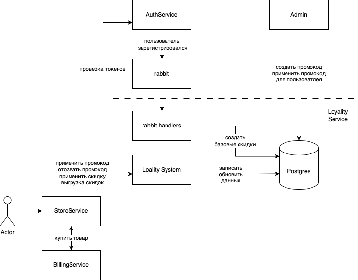

# Проектная работа: диплом

# Репозиторий для работы

https://github.com/lizatish/graduate_work/

# Архитектура сервиса



# Диаграмма классов


# Развертка приложения

Для работы сервиса авторизации необходимо запустить контейнеры из docker-compose.yaml

```
make build
make up
```

Для запуска приложения в корне необходимо положить файл со скрытыми конфигами `.env`, заполненный значениями переменных:

```
DATABASE_URL - полный путь до бд
DATABASE_URL_ASYNC - полный путь до бд (для асинхронной работы)
LOYALTY_POSTGRES_DB_USER - имя пользователя бд
LOYALTY_POSTGRES_DB_PASSWORD - пароль пользователя бд
LOYALTY_POSTGRES_DB_NAME - хост бд
LOYALTY_POSTGRES_DB_PORT - порт бд
```

# Тестирование

Тесты запускаются автоматически набором следующих команд:

```
cd tests/functional
docker-compose build
docker-compose up
```

# Сваггер

Сваггер развернут по урлу:
http://loyalty-service:6666/api/openapi

Общение с сервисом происходит по внутренней сети nginx

# Над проектом работали:

1. Тишковец Елизавета
    - реализация бизнес-логики промокодов
    - подключение CI/CD
    - создание архитектуры тестирования приложения
2. Рубцов Олег
    - реализация бизнес-логики скидок
    - разработка админки
    - подключение rabbit-handler-ов
    - создание архитектуры приложения
    - развертка ELK
